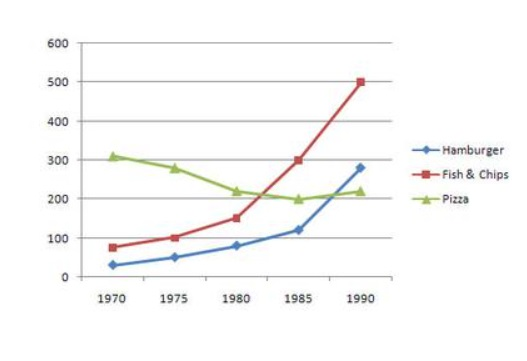
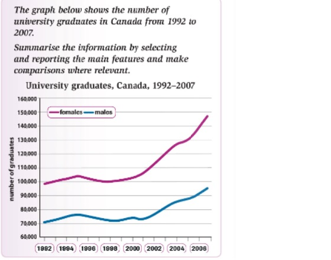

If you are taking Academic IELTS, task 1 of the writing module is to write a report based on visual data. You may be given a table, a line graph, a pie graph, a bar graph, a process diagram or a map. Line graphs are usually used to show trends. When a writing a report describing a line graph, you do not have to mention every minute detail. Focus on the highest and lowest points and any other major changes. Here are some report samples based on line graphs.

Sample report 1
The graph gives information about the consumption of three types of fast food (in grams per week) in the UK from 1970 to 1990.

UK fast food consumption

The line graph shows the weekly per capita consumption of the three fast foods fish & chips, hamburgers and pizzas in the UK between 1970 and 1990. It can be seen that while the consumption of pizza decreased during the given period, the consumption of the other two fast foods increased considerably. In 1970, pizza was the most popular of the three fast foods with people on average consuming 300 grams of it per week. The weekly consumption of fish & chips and hamburgers was very low. While people consumed about 80 grams of fish & chips / week, they consumed lesser quantities of hamburgers (30 grams / week). Over the next 20 years, the consumption of fish & chips increased considerably and in 1990, an average Brit was consuming 500 grams of it. The consumption of hamburgers also increased from nearly 30 gram/week to around 300 grams/week. Meanwhile, the consumption of pizza decreased from 300 grams/week to around 200 grams / week.

Sample report 2
The graph shows the number of university graduates in Canada from 1992 to 2007.

The line graph shows the number of men and men who graduated from Canadian universities between the years 1992 and 2007. Overall, it can be seen that there was an exponential increase in the number of female graduates during the given period. The number of male graduates also increased but the rise was not as spectacular as it was in the case of female graduates. In 1992, Canada had about 70,000 male and 100,000 female graduates. Their numbers increased during the next two years and then declined a little. The number of both male and female graduates started increasing again from 1998. While in 2000, the number of female graduates was about 105,000, by 2008, it had reached almost 150,000. The number of male graduates also grew during this period from 75,000 in 2000 to about 97,000 in 2008. Throughout the given period, the number of female graduates was considerably higher than the number of male graduates.