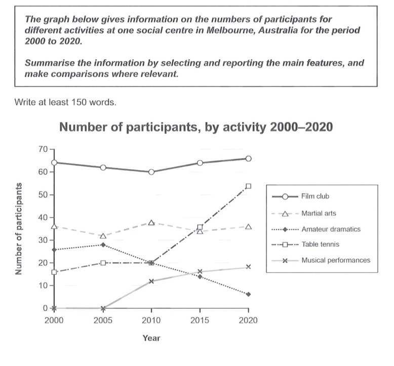

Participation in Various Activities at Social Centre | IELTS Cambridge 19
Posted by
By Manjusha
July 1, 2024
The graph below gives information on the number of participants for different activities at one social centre in Melbourne, Australia for the period 2000 to 2020.

Sample Report
The line graph shows the number of people who participated in various activities at a social centre in Melbourne during the period between 2000 to 2020. Overall, it can be seen that throughout the given period, the number of people who participated in the activities of the film club was considerably higher than the number of participants for other activities. In year 2000,  the film club saw the participation of 65 people. This number decreased marginally over the next 10 years and then increased again to reach 65 by 2020. Participation in martial arts fluctuated slightly during the given period; yet the number of participants at the end of the period was the same as the number of participants at the beginning (35). In 2000, about 25 people participated in amateur dramatics. This number increased a little over the next five years and then decreased sharply. In year 2020, only about 6 people took part in amateur dramatics. The number of participants for table tennis increased throughout the given period. From 2000 to 2010, it increased only marginally from 15 to 20. Over the next 10 years, it shot up and reached about 60 by 2020. Hardly anyone participated in musical events during the first 5 years. Afterwards, the number of participants increased continuously and by 2020, about 20 people participated in them.

Analysis
This is a good report. All major changes and all participant groups are covered. Grammar is good. A variety of sentence patterns are used with hardly any grammar mistakes. For example, there are both complex and compound sentences. The opening sentence is a complex sentence containing a relative clause. The writer is able to connect clauses with conjunctions and relative clauses and demonstrates a higher level of accuracy with grammatical structures. The information is presented logically and a number of cohesive elements (overall, afterwards) are used. Vocabulary is generally good. The writer makes good use of words and phrases that indicate change (decreased marginally, fluctuated slightly, decreased sharply, shot up). Overall, this seems band 9.