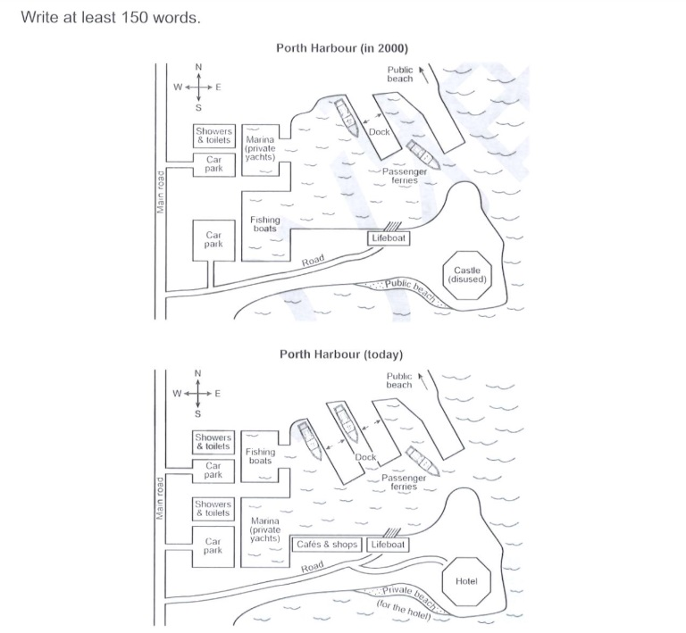

Porth Harbour Today and in Year 2000
Posted by
By Manjusha
July 2, 2024
The plans below show a harbour in 2000 and how it looks today. Summarise the information by selecting and reporting the main features, and make comparisons where relevant.

This question is taken from IELTS Cambridge 19.

porth harbour ielts
Sample report
The given maps show how Porth Harbour looked in year 2000 and the changes that took place since then. The main changes were the addition of some facilities like showers and toilets in the south-west and cafes and shops to the west of lifeboat. In addition, the areas meant for private yachts (marina) and fishing boats have been interchanged. The marina is now close to the newly built cafes and shops. Also, another dock has been built for passenger ferries. The disused castle in the south-east has been replaced by a hotel. What’s more, the public beach near the castle has been converted to a private beach meant for the hotel.  A new service road too has been built to the hotel. The public beach in the north-east is still accessible to the public and has not undergone any changes. Aside from the construction of a hotel and the addition of a few facilities like toilets and shops, there were no major changes.

Analysis
This report mentions all the changes that took place. The writer demonstrates good command of grammatical rules and structures. A variety of transitions are used effectively. Vocabulary is generally good. The opening sentence gives a brief account of what the report is about without borrowing too many words from the task rubric. The writer has managed to write more than the required number of words (150). This should get band 9.

What tense to use when reporting changes?
Use the simple past tense if you are writing about something that happened in the past. The simple past is also used to talk about past states.

For example

In year 2000, the harbour had some showers and toilets and two car parking areas in the west.
You can also use a structure with there.

In year 2000, there were some showers and toilets….
To talk about changes that took place during the period up to now, use the present perfect tense in the passive form.

Example:

Another dock for passenger ferries has been built.
The passive form is used here because we do not mention who built the dock.

The areas meant for the marina and the fishing boats have been interchanged.
The castle has been replaced by a hotel.
It is also possible to use the simple past (passive) here and you can write:

The castle was replaced by a hotel.
However, the present perfect is considered more appropriate to report these changes especially in British English.

Note that if you are reporting how the harbour looked in two years in the past (Example, 2000 and 2015), use the simple past throughout the report. Do not use the present perfect to report past events, states or changes.